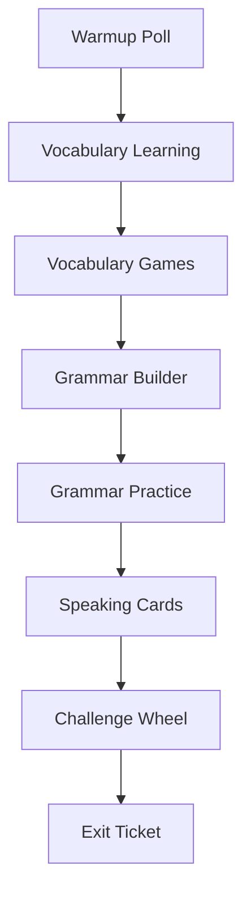

# Plan: Student Classroom Activities — Complete Rewrite

Companion docs:

- [plan-student-role-and-classroom-lessons.md](./plan-student-role-and-classroom-lessons.md) — roles, routes, phases
- [migrations/20260525100000_student_track_tables_and_roster.sql](../migrations/20260525100000_student_track_tables_and_roster.sql) — tables + MWS roster (52439–52470)

---

## Goal

Build a **separate classroom lesson track** for `role = student` with content and UX defined by the teacher lesson plan—not by extending the platform’s CEFR lesson flow.

**Activities are a complete rewrite.** Do not mount platform components (`SpeakingWithFeedback`, evaluation gates, AI integrity, 5-step `LessonStep` bar) inside the student runner.

**Reuse only:** design system (`Card`, `Button`, `Modal`, `ProgressBar`, layout, Tailwind tokens), auth cookies/JWT patterns, and generic utilities (timers, drag primitives if extracted—not whole activity files).

**Images:** vocabulary picture exercises use **`image_url`** (stable HTTPS links). **No emojis** in UI or as primary content.

---

## Users and scope

| Role | Track |
|------|--------|
| `user` | Platform lessons (`lessons`, `lesson_activities`) — unchanged |
| `admin` | Admin dashboard — unchanged |
| `student` | `student_*` tables, `/student/*` routes, no evaluation test |

Roster: pre-registered in migration (`school_student_id`, `{id}@mws.ac.th`, `role = student`).

---

## Lesson structure (different from platform)

### Platform (do not copy)

```
warmup → vocabulary → grammar → speaking → improvement
```

Multiple activity types per step; AI speaking; CEFR level unlock.

### Classroom (Lesson 1+)

**Eight sections, strict linear order:**



- One **section header** in the UI; one or more **activities** per section.
- Student advances section-by-section (or activity-by-activity within section—product choice: recommend **one screen = one activity** for simpler progress).
- No `advance-level`, no achievement titles, no eval test.

### Lesson 1 metadata

| Field | Value |
|-------|--------|
| Topic | My Online Life |
| Live | 30 min (teacher-led; stored as `live_duration_minutes`) |
| Communication goal | Practice speaking about online life. |
| Slug | `my-online-life` |

Store grammar blocks and full word list on `student_lessons.grammar_focus` and `student_lessons.vocabulary_list` (JSONB). Activities reference or duplicate subsets as needed.

---

## Database (required fields — do not skip)

Already created in migration. Every write path must populate the same fields the platform uses where mirrored.

### `student_lessons`

`lesson_number`, `topic`, `slug`, `live_duration_minutes`, `communication_goal`, `grammar_focus`, `vocabulary_list`, `active`, `version`, timestamps.

### `student_lesson_activities`

`student_lesson_id`, `activity_type`, `activity_order`, `title`, `description`, `estimated_time_seconds`, `content` (JSONB), `active`, timestamps.

### `student_vocabulary_items`

`activity_id`, `english_word`, `thai_translation` (optional EN-only), `audio_url`, **`image_url`** (required for picture match), `category`, `sort_order`, `created_at`.

- **`emoji`:** deprecated; do not use in new seeds. Optional follow-up migration: `COMMENT ON COLUMN student_vocabulary_items.emoji IS 'deprecated'`.

### `student_grammar_items`

`activity_id`, `item_kind`, `original_sentence`, `correct_sentence`, `words_array`, `options`, `hint`, `sort_order`.

`item_kind` ∈ `drag_order` | `mcq` | `frequency_select` | `free_completion` | `error_correction` | `make_question`.

### `student_poll_items`

`activity_id`, `question`, `options` JSONB `[{ "id": "a", "label": "Less than 1" }]`, `allow_multiple`, `sort_order`.

### `student_user_progress`

`user_id`, `student_lesson_id`, `score`, `completed`, `completed_at`, `attempts` — unique `(user_id, student_lesson_id)`.

### `student_lesson_activity_results`

`user_id`, `student_lesson_id`, `activity_id`, `activity_type`, `activity_order`, `score`, `max_score`, `attempts`, `time_spent`, `completed_at`, `answers`, `feedback` — unique `(user_id, student_lesson_id, activity_id)` when `activity_id` set.

### `users` (student identity)

`school_student_id`, `honorific`, `nickname`, `current_student_lesson`, `role = student`, `level = NULL`.

---

## Image policy (stable links, not emojis)

### Rules

1. Store full HTTPS URL in `student_vocabulary_items.image_url` (and optional `content.image_url` in JSONB).
2. Prefer **Wikimedia Commons** `upload.wikimedia.org` file URLs (permanent, CDN-backed).
3. Use **direct file paths** (not hotlinked search results or social CDNs that expire).
4. Frontend: `next/image` or `` with `referrerPolicy="no-referrer"`, fixed aspect ratio, alt text = `english_word`.
5. Optional: copy images to Supabase bucket `tutorcat/student-vocab/` later for full control; v1 = Wikimedia URLs below.

### Lesson 1 — Picture match (Exercise 1) seed URLs

| Word | Stable `image_url` |
|------|-------------------|
| play games | `https://upload.wikimedia.org/wikipedia/commons/9/98/Video-Game-Controller.jpg` |
| listen to music | `https://upload.wikimedia.org/wikipedia/commons/d/d6/Headphones_%28PSF%29.png` |
| chat | `https://upload.wikimedia.org/wikipedia/commons/8/8e/Chat-icon-comments.svg` |
| stream | `https://upload.wikimedia.org/wikipedia/commons/9/9d/YouTube_play_button_icon_%282013%E2%80%932017%29.svg` |

Additional vocab learning images (optional, same lesson):

| Word | Stable `image_url` |
|------|-------------------|
| phone | `https://upload.wikimedia.org/wikipedia/commons/5/5a/Smartphone_icon.png` |
| computer | `https://upload.wikimedia.org/wikipedia/commons/0/0b/Icon_mac.svg` |
| tablet | `https://upload.wikimedia.org/wikipedia/commons/3/3a/Tablet_icon.svg` |
| message | `https://upload.wikimedia.org/wikipedia/commons/4/4e/Mail_%28iOS%29.svg` |
| watch videos | `https://upload.wikimedia.org/wikipedia/commons/9/9f/Youtube%28red%29.svg` |
| scroll | `https://upload.wikimedia.org/wikipedia/commons/1/13/Swipe_icon.svg` |

---

## Activity types — new components (rewrite)

All live under `src/components/student/activities/`. Each exports a single props contract: `activity`, `lessonMeta`, `onComplete(result)`.

| `activity_type` | Section | New component | Platform reuse |
|-----------------|---------|---------------|----------------|
| `student_warmup_poll` | Warmup | `StudentWarmupPoll.tsx` | None (new poll UI) |
| `student_vocabulary_intro` | Vocabulary learning | `StudentVocabularyIntro.tsx` | Styles only; card grid + optional image per word |
| `student_vocab_picture_match` | Vocabulary games | `StudentPictureWordMatch.tsx` | **Rewrite** — image tiles, not Konva emoji |
| `student_vocab_missing_letters` | Vocabulary games | `StudentMissingLetters.tsx` | **Rewrite** — typed letters, not dropdown lesson fill |
| `student_vocab_categorize` | Vocabulary games | `StudentWordCategorize.tsx` | **Rewrite** — three buckets drag/drop |
| `student_vocab_speed_tap` | Vocabulary games | `StudentSpeedTap.tsx` | **Rewrite** — 30s timer, tap targets |
| `student_grammar_builder` | Grammar builder | `StudentGrammarBuilder.tsx` | **Rewrite** — read-only sections from `grammar_focus` |
| `student_grammar_drag_order` | Grammar practice | `StudentGrammarDragOrder.tsx` | Inspired by drag UX; **new** data shape |
| `student_grammar_mcq` | Grammar practice | `StudentGrammarMcq.tsx` | **Rewrite** |
| `student_grammar_frequency` | Grammar practice | `StudentGrammarFrequency.tsx` | **Rewrite** |
| `student_grammar_complete` | Grammar practice | `StudentGrammarComplete.tsx` | **Rewrite** — two text fields |
| `student_grammar_error_fix` | Grammar practice | `StudentGrammarErrorFix.tsx` | **Rewrite** — editable sentence |
| `student_grammar_make_question` | Grammar practice | `StudentGrammarMakeQuestion.tsx` | **Rewrite** — word bank → question |
| `student_speaking_cards` | Speaking | `StudentSpeakingCards.tsx` | **Rewrite** — flip cards, no speech-job v1 |
| `student_challenge_wheel` | Challenge | `StudentChallengeWheel.tsx` | **Rewrite** — spin + 30s timer |
| `student_exit_poll` | Exit ticket | `StudentExitPoll.tsx` | Share poll component with warmup |

Registry: `src/components/student/StudentActivityRenderer.tsx` maps `activity_type` → component (replace platform `lessons/page.tsx` switch).

---

## Lesson 1 — section-by-section spec

### 1. Warmup Poll (`student_warmup_poll`)

**Poll 1** — `student_poll_items`:

- Question: *How many hours are you online?*
- Options: Less than 1 | 1–2 | 3–5 | 6+

`content`: `{ "section": "warmup", "required": true }`  
Scoring: participation only (`max_score: 1` on submit). Store choice in `answers.selected_option_id`.

---

### 2. Vocabulary Learning (`student_vocabulary_intro`)

Display all **15–20 words** from lesson plan (grouped: Apps/technology, Online activities, Opinion words).

**Data:**

- Rows in `student_vocabulary_items` (all categories, `image_url` where available).
- `content`: `{ "show_thai": false, "group_by_category": true }`

No score gate; complete on “Continue” after viewing all cards (or min time on page).

**Word list to seed:**

Apps/technology: app, website, phone, tablet, computer, internet  

Online activities: chat, message, call, watch videos, play games, listen to music, stream, post, search, scroll, download, upload  

Opinion words: fun, boring, interesting, useful, funny, exciting

---

### 3. Vocabulary Games (4 activities)

#### 3a. Picture → word (`student_vocab_picture_match`)

- 4 pairs from lesson plan; use **image_url table above**.
- `student_vocabulary_items`: `english_word` + `image_url`; `content.correct_pairs` or implicit 1:1 match.
- UI: left column images, right column shuffled words; tap or drag line to match.
- `max_score`: number of pairs; all correct to continue.

#### 3b. Missing letters (`student_vocab_missing_letters`)

`content.sentences`:

```json
[
  { "template": "pl__ g__es", "answer": "play games" },
  { "template": "wa__h vid__s", "answer": "watch videos" },
  { "template": "mes__ge", "answer": "message" },
  { "template": "scr__ll", "answer": "scroll" }
]
```

Letter inputs per blank; validate on submit.

#### 3c. Categorize (`student_vocab_categorize`)

`content.buckets`: `Apps/Devices` | `Activities` | `Opinions`  

Words to drag (from plan):

- Apps/Devices: phone, computer, tablet  
- Activities: play games, stream, message  
- Opinions: fun, boring, exciting  

Also store in `student_vocabulary_items` with `category` set.

#### 3d. Speed challenge (`student_vocab_speed_tap`)

`content`: `{ "duration_seconds": 30, "targets": ["play games", "scroll", "upload", "message"], "distractors": ["interesting", "phone"] }`

Student taps only **activity words** (per plan: play games, interesting, scroll, phone, upload, message — clarify: targets = activity words only; *interesting* and *phone* are distractors not to tap).

Scoring: correct taps − false taps, normalized to `max_score`.

---

### 4. Grammar Builder (`student_grammar_builder`)

Read-only expandable cards from `student_lessons.grammar_focus`:

```json
{
  "simple_present": {
    "structure": "Subject + verb + object",
    "examples": ["I play games.", "I watch videos.", "I use YouTube.", "I chat with friends."]
  },
  "frequency_adverbs": {
    "structure": "Subject + frequency + verb",
    "examples": ["I always listen to music.", "..."],
    "ladder": ["Always", "Usually", "Sometimes", "Rarely", "Never"]
  },
  "like_dislike": {
    "examples": ["I like YouTube because it is interesting.", "..."]
  },
  "question_forms": {
    "examples": ["What app do you use?", "How many hours are you online?", "Do you play games?", "What do you watch?"]
  }
}
```

Complete on “I’m ready” button.

---

### 5. Grammar Practice (6 activity types)

| Order | Type | Lesson content |
|------:|------|----------------|
| 1 | `student_grammar_drag_order` | (1) `usually / games / I / play` → `I usually play games.` (2) `never / videos / post / I` → `I never post videos.` |
| 2 | `student_grammar_mcq` | (1) `I ___ games every day.` → play (2) `I ___ usually watch videos.` → blank |
| 3 | `student_grammar_frequency` | `I _____ eat pizza every day.` → always / sometimes / never (teacher picks correct in seed) |
| 4 | `student_grammar_complete` | `My favorite app is ______ because ______.` |
| 5 | `student_grammar_error_fix` | Fix: `I usually playing games.` / `I use always YouTube.` |
| 6 | `student_grammar_make_question` | Words: `you / use / what app / do` → `What app do you use?` |

Each maps to one+ rows in `student_grammar_items` with appropriate `item_kind` and `options` JSONB for MCQ.

---

### 6. Speaking Cards (`student_speaking_cards`)

`content.prompts` (partner questions — no AI v1):

1. What app do you use most?  
2. How many hours are you online?  
3. What do you usually do online?  
4. Do you play games?  
5. What app do you dislike?  
6. Why?

UI: card deck, swipe/flip, mark each as practiced. Optional mic icon v2.

---

### 7. Challenge Wheel (`student_challenge_wheel`)

`content`: `{ "duration_seconds": 30, "prompts": ["My favorite app", "My screen time", "My online habits", "Apps I dislike", "Games I play", "What I do after school"] }`

Spin → show prompt → timer → self-rated done (honor system v1).

---

### 8. Exit Ticket (`student_exit_poll`)

**Polls 2–4** (three `student_poll_items` or one activity with three questions):

| Poll | Question | Options |
|------|----------|---------|
| 2 | Which app would disappear forever? | TikTok, YouTube, Instagram, Games |
| 3 | What do you do most online? | Watch videos, Play games, Chat, Listen to music |
| 4 | What is hardest to live without? | Phone, Internet, Games, Music |

Submit → `finalize-student-lesson` → completion modal.

---

## Lesson 1 — activity order (seed)

| `activity_order` | `activity_type` | Title |
|-----------------:|-----------------|-------|
| 1 | `student_warmup_poll` | Warmup: Hours online |
| 2 | `student_vocabulary_intro` | Learn: Online vocabulary |
| 3 | `student_vocab_picture_match` | Match: Picture → word |
| 4 | `student_vocab_missing_letters` | Spell: Missing letters |
| 5 | `student_vocab_categorize` | Sort: Word categories |
| 6 | `student_vocab_speed_tap` | Speed: Activity words |
| 7 | `student_grammar_builder` | Grammar: Rules |
| 8 | `student_grammar_drag_order` | Practice: Sentence order |
| 9 | `student_grammar_mcq` | Practice: Choose answer |
| 10 | `student_grammar_frequency` | Practice: Frequency words |
| 11 | `student_grammar_complete` | Practice: Complete the sentence |
| 12 | `student_grammar_error_fix` | Practice: Fix the mistake |
| 13 | `student_grammar_make_question` | Practice: Make a question |
| 14 | `student_speaking_cards` | Speaking: Partner questions |
| 15 | `student_challenge_wheel` | Challenge: 30-second speak |
| 16 | `student_exit_poll` | Exit ticket |

---

## Frontend routes (student)

| Path | Purpose |
|------|---------|
| `/student/dashboard` | Lesson list + progress |
| `/student/profile` | Name, school ID, nickname, stats (rewrite, not copy `/profile`) |
| `/student/lessons/[id]` | **New** `StudentLessonRunner` only |

Login redirect: `student` → `/student/dashboard`; block `/lessons`, `/evaluation`, `/dashboard`.

---

## Backend (student APIs)

| Endpoint | Purpose |
|----------|---------|
| `get-student-lesson` | Lesson + activities + child rows + progress |
| `get-student-dashboard` | Lessons + completion % |
| `submit-student-lesson-activity` | Upsert `student_lesson_activity_results` + `student_user_progress` |
| `finalize-student-lesson` | Aggregate scores; set `completed` |
| `admin-student-lessons` | CRUD + seed (v1: SQL seed file acceptable) |

Auth: JWT `role === 'student'`; reject platform lesson endpoints for students.

---

## SQL seed (next file)

Created [migrations/20260525200000_seed_student_lesson_1_my_online_life.sql](../migrations/20260525200000_seed_student_lesson_1_my_online_life.sql):

1. Insert `student_lessons` row (lesson_number = 1).  
2. Insert 16 `student_lesson_activities`.  
3. Insert `student_vocabulary_items` with **`image_url`** (Wikimedia table above).  
4. Insert `student_grammar_items` / `student_poll_items` for all exercises.  

No emoji in any column.

---

## Implementation phases

### Phase A — Runner shell

- [ ] `StudentLessonRunner` + section progress UI (8 segments)
- [ ] `get-student-lesson` + types
- [ ] `StudentActivityRenderer` stub

### Phase B — Vocabulary (rewrite)

- [ ] `StudentVocabularyIntro` (images optional per word)
- [ ] `StudentPictureWordMatch` (**images from `image_url`**)
- [ ] `StudentMissingLetters`, `StudentWordCategorize`, `StudentSpeedTap`
- [ ] Seed SQL Lesson 1 vocab + activities 1–6

### Phase C — Grammar (rewrite)

- [ ] `StudentGrammarBuilder`
- [ ] All six grammar practice components
- [ ] Seed grammar rows activities 7–13

### Phase D — Speaking + close

- [ ] `StudentSpeakingCards`, `StudentChallengeWheel`
- [ ] `StudentWarmupPoll` / `StudentExitPoll`
- [ ] Poll seed + finalize

### Phase E — Auth & profile

- [ ] Login redirect for `student`
- [ ] `/student/profile` rewrite
- [ ] Dashboard lesson cards

---

## What we explicitly do NOT do

- Import `src/app/lessons/page.tsx` step logic into student routes.
- Use `SpeakingWithFeedback` / `speech_jobs` in v1 (optional v2 for challenge wheel).
- Use emojis for picture match.
- Store lesson content only in frontend hardcode—always DB-driven for student track.
- Mix `lesson_activities` and `student_lesson_activities` in one runner.

---

## Open decisions

1. **Pass rule:** complete all sections vs. 60% score (platform uses 60% on finalize).  
2. **Frequency exercise 3:** which option is “correct” for pizza sentence (teach: *always* vs accept any with explanation).  
3. **Speed tap:** exact target/distractor list (plan uses distractors `interesting`, `phone`).  
4. **Self-host images:** migrate Wikimedia URLs to Supabase bucket before production scale.

---

## Success criteria

1. Student logs in with `52439@mws.ac.th`, opens Lesson 1, sees 8-section flow.  
2. Picture match shows **photos/icons from URLs**, not emojis.  
3. All 16 activities match the lesson plan copy and exercises.  
4. Results persist in `student_lesson_activity_results` with full field set.  
5. Platform `user` lessons unchanged.
