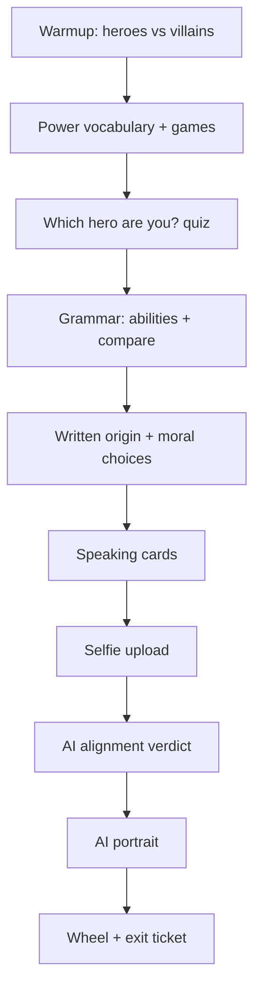

# Plan: Student Lesson 4 — Create Your Superhero (Heroes vs Villains)

Companion docs:

- [plan-student-activities-rewrite.md](./plan-student-activities-rewrite.md) — activity patterns, grading rules
- [plan-student-role-and-classroom-lessons.md](./plan-student-role-and-classroom-lessons.md) — student track overview
- [.cursor/rules/student-lesson-isolation.mdc](../.cursor/rules/student-lesson-isolation.mdc) — **only touch `slug = 'create-your-superhero'`**
- Lesson 3 reference: [migrations/20260616160000_seed_student_lesson_3_design_character_full.sql](../migrations/20260616160000_seed_student_lesson_3_design_character_full.sql)

---

## Goal

Lesson 4 is a **longer, more interactive** classroom lesson where students **discover which hero they are like** (precoded quiz), **build an original character profile** using English vocabulary and grammar, **save every choice to the database**, take a **selfie**, and receive an **AI “alignment” verdict** (hero / villain / anti-hero) plus **one AI-generated original portrait**.

**Product promise:** Every step feels like a game; **every step is scored** (no “tap through and forget” screens).

---

## Size target (2× Lesson 3)

| Metric | Lesson 3 | Lesson 4 target |
|--------|----------|-----------------|
| Activities | 9 | **18** |
| Estimated student time | ~35 min | **~60–70 min** |
| `live_duration_minutes` | 35 | **60** |
| Vocabulary items | ~29 | **~40** |
| Speaking prompts | 4 + wheel | **6 cards + wheel** |
| Unique interactive climax | Character builder | **Personality quiz → hero match** + selfie + AI alignment + portrait |

---

## Hard rules (non‑negotiable)

### 1. Every activity is graded

Each activity submission must produce `score` + `max_score` in `student_lesson_activity_results`. No exceptions.

| Allowed | Not allowed |
|---------|-------------|
| MCQ, match, spell, categorize, speed tap, sentence builder with keyed answers | Vocab intro **alone** with no follow-up check in the same section |
| Speaking cards / wheel (AI `overall_score` per prompt) | Grammar builder “read rules” **without** a scored practice activity immediately after |
| Photo upload (score = 1/1 when valid image captured) | Polls without `correct_option_id` unless paired with a graded reflection MCQ in the **next** activity |
| Image compare (score = viewed both + submitted pick) | “Press Continue when done” with `max_score: 0` |

**Pattern:** If students need study time, use `study_seconds` on vocab intro **and** grade the **next** activity (match / MCQ / spell) on the same words.

### 2. Persist everything

All builder / branch / text / photo metadata lives in `student_lesson_activity_results.answers` (JSONB), keyed by `activity_order` — same pattern as Lesson 3 character builder. Optional aggregate row in a new table (see [Data model](#data-model)) for admin reporting and image URLs.

### 3. Copyright (two zones)

**Activity #7 (personality quiz):** Named DC characters for a **classroom personality match** only. Teacher supplies portrait photos (see [Activity #7](#activity-7--student_superhero_builder-which-hero-are-you)). No AI in this step. Use for English discussion (“You are like Batman because…”).

**Activities #15–16 (AI alignment + image gen):** Still **original character only** in prompts:

- Describe an **original** character (“a new superhero created for a school project”).
- **Do not** send trademark names or likenesses to image APIs.
- Use student **traits and colors** from quiz + profile, not “draw Superman”.
- Include safety refusal handling (no gore, weapons glorification, hate).

### 4. Lesson isolation

One migration seed: `DELETE FROM student_lessons WHERE slug = 'create-your-superhero'` then insert. All patches filter by that slug only.

---

## Theme & learning outcomes

**Topic:** Create Your Superhero  
**Slug:** `create-your-superhero`  
**Communication goal:** Describe powers, personality, and moral choices; explain whether your character is a hero or a villain.

**Grammar focus (examples):**

- Abilities: *can / can’t*, *is able to*
- Comparison: *stronger than*, *faster than*, *more dangerous than*
- Character: *He/She is + adjective*, *He/She wants to + verb*

Full word lists and exercise copy are in [Content spec: vocabulary & grammar](#content-spec-vocabulary--grammar) below.

---

## Student journey (high level)



**Narrative hook:** “Answer ten questions about yourself. The app shows which hero you are most like — and why. Later, AI will judge if your *own* character is a hero or a villain, and draw an original portrait.”

---

## Activity list (18 steps, all scored)

Estimated times are per activity (`estimated_time_seconds`). Total ≈ **3,600 s (60 min)**.

| # | Section | `activity_type` | Title | Scoring |
|---|---------|-----------------|-------|---------|
| 1 | Warmup | `student_speaking_cards` | Warmup: Heroes vs villains | AI score per prompt (×100 max each). Prompts: “What’s the difference between a superhero and a supervillain?” + “Who is cooler and why?” |
| 2 | Vocab | `student_vocabulary_intro` | Learn: Superpowers | Completion 1/1 after `study_seconds` **or** move study into #3 only |
| 3 | Vocab | `student_vocab_picture_match` | Match: Power → picture | 1 pt per pair |
| 4 | Vocab | `student_vocab_missing_letters` | Spell: Powers | 1 pt per word |
| 5 | Vocab | `student_vocab_categorize` | Sort: Hero trait vs villain trait | 1 pt per word |
| 6 | Vocab | `student_vocab_speed_tap` | Speed: Power words | 1 pt per target hit |
| 7 | Build | `student_superhero_builder` *(new)* | Which hero are you? | 1 pt per question (10 dropdowns). Precoded hero match + “why” reveal. **No AI.** |
| 8 | Grammar | `student_grammar_builder` | Grammar: can / can’t | 1/1 after timer + **must** complete #9 |
| 9 | Grammar | `student_grammar_mcq` | Practice: Abilities | 1 pt per item |
| 10 | Grammar | `student_grammar_drag_order` | Compare: stronger / faster | 1 pt per sentence |
| 11 | Write | `student_superhero_profile` *(new)* | Powers & weakness sentences | 1 pt per correct dropdown slot |
| 12 | Morals | `student_speaking_cards` | Moral choices: What would you do? | Speaking cards for 3 scenarios. Student answers out loud and then taps a choice (stored). AI score per scenario (×100 max each). |
| 13 | Speak | `student_speaking_cards` | Origin story | AI score per prompt (×100 max each) |
| 14 | Photo | `student_selfie_capture` *(new)* | Your hero face | 1/1 valid image ≤5MB |
| 15 | AI | `student_alignment_reveal` *(new)* | Hero or villain? AI verdict | 1/1 after reveal; bonus MCQ: “Do you agree?” 1 pt |
| 16 | AI Art | `student_superhero_image_generate` *(new)* | AI draws your character (one image) | 1/1 when the image is successfully generated and shown. Store provider + prompt + URL. |
| 17 | Speak | `student_challenge_wheel` | Power wheel 30s | AI overall_score /100 |
| 18 | Exit | `student_exit_poll` | Exit: picture → word | 1 pt per item (`correct_option_id`) |

> **Note on #1–2:** If product wants zero “free” screens, drop standalone vocab intro and embed words in match + categorize only; keep a 90s “study deck” inside `student_vocab_picture_match` content.

---

## Content spec: vocabulary & grammar

Authoring source for the seed migration. **40 words** on `student_lessons.vocabulary_list`; per-activity subsets below mirror L1/L2/L3 seed shape (`student_vocabulary_items`, `student_grammar_items`).

### `student_lessons.vocabulary_list` (full lesson — 40 words)

```json
[
  {"category": "Powers", "words": ["fly", "run fast", "jump high", "read minds", "control fire", "turn invisible", "super strength", "teleport", "freeze things", "see the future", "heal people", "shoot lasers"]},
  {"category": "Hero traits", "words": ["brave", "honest", "helpful", "protective", "loyal", "kind", "selfless"]},
  {"category": "Villain traits", "words": ["selfish", "cruel", "greedy", "sneaky", "jealous", "evil", "dangerous"]},
  {"category": "Gear and look", "words": ["cape", "mask", "armor", "boots", "glowing eyes", "claws", "shield", "helmet"]},
  {"category": "Story", "words": ["save the city", "steal", "trick", "fight", "hide", "team up"]}
]
```

### `student_lessons.grammar_focus` (activity #8 builder cards)

```json
{
  "abilities": {
    "structure": "Subject + can / can't + verb",
    "examples": [
      "She can fly.",
      "He can't read minds.",
      "They can run fast."
    ]
  },
  "is_able_to": {
    "structure": "Subject + is / are + (not) able to + verb",
    "examples": [
      "She is able to control fire.",
      "He is not able to turn invisible.",
      "We are able to team up."
    ]
  },
  "comparison": {
    "structure": "adjective-er + than / more + adjective + than",
    "examples": [
      "She is faster than him.",
      "My hero is stronger than a normal person.",
      "Villains are more dangerous than heroes."
    ]
  },
  "character": {
    "structure": "He/She is + adjective. He/She wants to + verb.",
    "examples": [
      "She is brave.",
      "He wants to save the city.",
      "My hero is loyal."
    ]
  }
}
```

---

### Activity #2 — `student_vocabulary_intro` (Learn: Superpowers)

**Content:** `{ "group_by_category": true, "show_thai": false, "tap_thai_translation": true, "study_seconds": 180 }`

**All 40 words** (`student_vocabulary_items` — English + Thai + category + **`image_url`**):

| # | English | Thai | Category | Image (Commons file) | `image_url` (verified) | Fit |
|---|---------|------|----------|----------------------|-------------------------|-----|
| 1 | fly | บิน | Powers | `Twemoji12_1f985.svg` | `https://upload.wikimedia.org/wikipedia/commons/e/e1/Twemoji12_1f985.svg` | 🦅 eagle — flying |
| 2 | run fast | วิ่งเร็ว | Powers | `Twemoji12_1f3c3-200d-2642-fe0f.svg` | `https://upload.wikimedia.org/wikipedia/commons/8/82/Twemoji12_1f3c3-200d-2642-fe0f.svg` | 🏃 runner |
| 3 | jump high | กระโดดสูง | Powers | `Twemoji12_1f938-200d-2640-fe0f.svg` | `https://upload.wikimedia.org/wikipedia/commons/1/16/Twemoji12_1f938-200d-2640-fe0f.svg` | 🤸 cartwheel / jump |
| 4 | read minds | อ่านความคิด | Powers | `Twemoji12_1f9e0.svg` | `https://upload.wikimedia.org/wikipedia/commons/b/bb/Twemoji12_1f9e0.svg` | 🧠 brain |
| 5 | control fire | ควบคุมไฟ | Powers | `Twemoji12_1f525.svg` | `https://upload.wikimedia.org/wikipedia/commons/9/98/Twemoji12_1f525.svg` | 🔥 fire (L2 seed) |
| 6 | turn invisible | ล่องหน | Powers | `Twemoji12_1f47b.svg` | `https://upload.wikimedia.org/wikipedia/commons/6/66/Twemoji12_1f47b.svg` | 👻 ghost |
| 7 | super strength | พลังมหาศาล | Powers | `Twemoji12_1f4aa.svg` | `https://upload.wikimedia.org/wikipedia/commons/a/af/Twemoji12_1f4aa.svg` | 💪 flexed biceps |
| 8 | teleport | วาร์ป | Powers | `Twemoji12_2728.svg` | `https://upload.wikimedia.org/wikipedia/commons/3/3d/Twemoji12_2728.svg` | ✨ sparkles / warp |
| 9 | freeze things | แช่แข็ง | Powers | `Twemoji12_2744.svg` | `https://upload.wikimedia.org/wikipedia/commons/d/db/Twemoji12_2744.svg` | ❄️ snowflake |
| 10 | see the future | มองเห็นอนาคต | Powers | `Twemoji12_1f52e.svg` | `https://upload.wikimedia.org/wikipedia/commons/3/3c/Twemoji12_1f52e.svg` | 🔮 crystal ball |
| 11 | heal people | รักษาคน | Powers | `Twemoji12_1fa79.svg` | `https://upload.wikimedia.org/wikipedia/commons/4/41/Twemoji12_1fa79.svg` | 🩹 bandage |
| 12 | shoot lasers | ยิงเลเซอร์ | Powers | `Twemoji12_26a1.svg` | `https://upload.wikimedia.org/wikipedia/commons/1/19/Twemoji12_26a1.svg` | ⚡ high voltage / zap |
| 13 | brave | กล้าหาญ | Hero traits | `Twemoji12_1f981.svg` | `https://upload.wikimedia.org/wikipedia/commons/0/03/Twemoji12_1f981.svg` | 🦁 lion |
| 14 | honest | ซื่อสัตย์ | Hero traits | `Twemoji12_2696.svg` | `https://upload.wikimedia.org/wikipedia/commons/7/7b/Twemoji12_2696.svg` | ⚖️ scales of justice |
| 15 | helpful | ช่วยเหลือ | Hero traits | `Twemoji12_1f64c.svg` | `https://upload.wikimedia.org/wikipedia/commons/7/78/Twemoji12_1f64c.svg` | 🙌 raised hands (L3 seed) |
| 16 | protective | ปกป้อง | Hero traits | `Twemoji12_1f6e1.svg` | `https://upload.wikimedia.org/wikipedia/commons/f/f2/Twemoji12_1f6e1.svg` | 🛡️ shield |
| 17 | loyal | ซื่อสัตย์ต่อเพื่อน | Hero traits | `Twemoji12_1f91d.svg` | `https://upload.wikimedia.org/wikipedia/commons/3/3e/Twemoji12_1f91d.svg` | 🤝 handshake (L3 seed) |
| 18 | kind | ใจดี | Hero traits | `Twemoji12_2764.svg` | `https://upload.wikimedia.org/wikipedia/commons/8/82/Twemoji12_2764.svg` | ❤️ heart (L2/L3 seed) |
| 19 | selfless | ไม่เห็นแก่ตัว | Hero traits | `Twemoji12_1f381.svg` | `https://upload.wikimedia.org/wikipedia/commons/4/42/Twemoji12_1f381.svg` | 🎁 gift / giving |
| 20 | selfish | เห็นแก่ตัว | Villain traits | `Twemoji_1f4b0.svg` | `https://upload.wikimedia.org/wikipedia/commons/b/bb/Twemoji_1f4b0.svg` | 💰 money bag (L3 seed) |
| 21 | cruel | โหดร้าย | Villain traits | `Twemoji12_1f621.svg` | `https://upload.wikimedia.org/wikipedia/commons/f/f0/Twemoji12_1f621.svg` | 😡 angry face (L3 seed) |
| 22 | greedy | โลภ | Villain traits | `Twemoji12_1f911.svg` | `https://upload.wikimedia.org/wikipedia/commons/c/ce/Twemoji12_1f911.svg` | 🤑 money-mouth |
| 23 | sneaky | แอบแฝง | Villain traits | `Twemoji12_1f92b.svg` | `https://upload.wikimedia.org/wikipedia/commons/2/22/Twemoji12_1f92b.svg` | 🤫 shushing (L3 “quiet”) |
| 24 | jealous | อิจฉา | Villain traits | `Twemoji12_1f47f.svg` | `https://upload.wikimedia.org/wikipedia/commons/e/ef/Twemoji12_1f47f.svg` | 👿 imp |
| 25 | evil | ชั่วร้าย | Villain traits | `Twemoji12_1f480.svg` | `https://upload.wikimedia.org/wikipedia/commons/5/5e/Twemoji12_1f480.svg` | 💀 skull |
| 26 | dangerous | อันตราย | Villain traits | `Warning_Emoji.svg` | `https://upload.wikimedia.org/wikipedia/commons/f/ff/Warning_Emoji.svg` | ⚠️ warning sign |
| 27 | cape | ผ้าคลุม | Gear and look | `Superhero.svg` | `https://upload.wikimedia.org/wikipedia/commons/3/3f/Superhero.svg` | Generic red-caped figure (CC, not branded IP) |
| 28 | mask | หน้ากาก | Gear and look | `Twemoji12_1f3ad.svg` | `https://upload.wikimedia.org/wikipedia/commons/0/08/Twemoji12_1f3ad.svg` | 🎭 theater masks |
| 29 | armor | เกราะ | Gear and look | `Wikipe-tan knight.svg` | `https://upload.wikimedia.org/wikipedia/commons/d/dc/Wikipe-tan_knight.svg` | Knight in armor (CC mascot art) |
| 30 | boots | รองเท้าบูท | Gear and look | `Twemoji12_1f462.svg` | `https://upload.wikimedia.org/wikipedia/commons/c/c6/Twemoji12_1f462.svg` | 👢 boot |
| 31 | glowing eyes | ตาเรืองแสง | Gear and look | `Twemoji12_1f929.svg` | `https://upload.wikimedia.org/wikipedia/commons/7/76/Twemoji12_1f929.svg` | 🤩 star-struck (star eyes) |
| 32 | claws | กรงเล็บ | Gear and look | `Twemoji12_1f43a.svg` | `https://upload.wikimedia.org/wikipedia/commons/6/66/Twemoji12_1f43a.svg` | 🐺 wolf (claws implied) |
| 33 | shield | โล่ | Gear and look | `Twemoji12_1f6e1.svg` | `https://upload.wikimedia.org/wikipedia/commons/f/f2/Twemoji12_1f6e1.svg` | 🛡️ shield (same as #16 — OK) |
| 34 | helmet | หมวกกันน็อ | Gear and look | `Twemoji12_26d1.svg` | `https://upload.wikimedia.org/wikipedia/commons/e/eb/Twemoji12_26d1.svg` | ⛑️ rescue helmet |
| 35 | save the city | ช่วยเมือง | Story | `Twemoji12_1f3d9.svg` | `https://upload.wikimedia.org/wikipedia/commons/8/8f/Twemoji12_1f3d9.svg` | 🏙️ city skyline |
| 36 | steal | ขโมย | Story | `Twemoji12_1f45b.svg` | `https://upload.wikimedia.org/wikipedia/commons/c/cf/Twemoji12_1f45b.svg` | 👛 handbag / wallet (classroom-safe) |
| 37 | trick | หลอกลวง | Story | `Twemoji12_1f0cf.svg` | `https://upload.wikimedia.org/wikipedia/commons/b/b8/Twemoji12_1f0cf.svg` | 🃏 joker card |
| 38 | fight | ต่อสู้ | Story | `Twemoji12_1f94a.svg` | `https://upload.wikimedia.org/wikipedia/commons/0/07/Twemoji12_1f94a.svg` | 🥊 boxing glove |
| 39 | hide | ซ่อนตัว | Story | `Twemoji12_1f648.svg` | `https://upload.wikimedia.org/wikipedia/commons/e/ea/Twemoji12_1f648.svg` | 🙈 see-no-evil monkey |
| 40 | team up | ร่วมมือ | Story | `Twemoji12_1f465.svg` | `https://upload.wikimedia.org/wikipedia/commons/8/8c/Twemoji12_1f465.svg` | 👥 people silhouettes (L2 seed) |

**Verification (2026-06-18):** Each URL resolved with Wikimedia Commons `action=query&prop=imageinfo`. Twelve overlap L1–L3 production seeds (already used in app). Sample URLs returned HTTP 200 via `upload.wikimedia.org` HEAD before rate-limit; use the same `imageinfo` step when seeding. Prefer **direct `upload.wikimedia.org` URLs** in SQL (not `Special:FilePath` wiki links) — matches [`src/lib/studentVocabImages.ts`](../src/lib/studentVocabImages.ts).

**Scoring:** `max_score: 1` when student completes `study_seconds` (same pattern as L1/L2 intro with timer completion).

---

### Activity #3 — `student_vocab_picture_match` (Match: Power → picture)

**4 pairs** (`student_vocabulary_items` — word + `image_url`; reuse URLs from #2 table):

| English | `image_url` | Fit |
|---------|-------------|-----|
| fly | `https://upload.wikimedia.org/wikipedia/commons/e/e1/Twemoji12_1f985.svg` | 🦅 eagle |
| control fire | `https://upload.wikimedia.org/wikipedia/commons/9/98/Twemoji12_1f525.svg` | 🔥 fire |
| turn invisible | `https://upload.wikimedia.org/wikipedia/commons/6/66/Twemoji12_1f47b.svg` | 👻 ghost |
| super strength | `https://upload.wikimedia.org/wikipedia/commons/a/af/Twemoji12_1f4aa.svg` | 💪 flexed biceps |

All four verified live via Commons `imageinfo`; distinct icons, no overlap with distractor words in speed tap.

---

### Activity #4 — `student_vocab_missing_letters` (Spell: Powers)

**Content `sentences` array (exact templates + answers):**

| Template | Answer |
|----------|--------|
| `fl__` | fly |
| `t__n inv__ible` | turn invisible |
| `sup__ str__ngth` | super strength |
| `c__trol f__e` | control fire |
| `t__eport` | teleport |
| `r__d m__ds` | read minds |

**Scoring:** 1 pt × 6 = `max_score: 6`.

---

### Activity #5 — `student_vocab_categorize` (Sort: Hero trait vs villain trait)

**Content:** `{ "buckets": ["Hero trait", "Villain trait"] }`

**10 words** (`student_vocabulary_items` — word + category bucket):

| English | Bucket |
|---------|--------|
| brave | Hero trait |
| honest | Hero trait |
| helpful | Hero trait |
| loyal | Hero trait |
| kind | Hero trait |
| selfish | Villain trait |
| cruel | Villain trait |
| greedy | Villain trait |
| sneaky | Villain trait |
| jealous | Villain trait |

**Scoring:** 1 pt × 10 = `max_score: 10`.

---

### Activity #6 — `student_vocab_speed_tap` (Speed: Power words)

**Content:**

```json
{
  "targets": ["fly", "teleport", "read minds", "super strength"],
  "distractors": ["cape", "brave", "selfish", "save the city", "mask", "honest"]
}
```

**Scoring:** 1 pt per target hit = `max_score: 4`.

---

### Activity #7 — `student_superhero_builder` (Which hero are you?)

**Replaces** the Lesson 3-style visual avatar builder. A **10-question dropdown quiz** (4 options each). After submit, show the best-matching hero portrait + a short **precoded “why”** paragraph. **No AI** — all logic and copy in seed JSON + component.

#### Hero roster (teacher adds photos later)

| Gender pool | `hero_id` | Display name | Image path (placeholder) |
|-------------|-----------|--------------|----------------------------|
| boy | `aquaman` | Aquaman | `/superheroes/boys/aquaman.jpg` |
| boy | `peacemaker` | Peacemaker | `/superheroes/boys/peacemaker.jpg` |
| boy | `superman` | Superman | `/superheroes/boys/superman.jpg` |
| boy | `batman` | Batman | `/superheroes/boys/batman.jpg` |
| boy | `joker` | Joker | `/superheroes/boys/joker.jpg` |
| girl | `wonder_woman` | Wonder Woman | `/superheroes/girls/wonder-woman.jpg` |
| girl | `supergirl` | Supergirl | `/superheroes/girls/supergirl.jpg` |
| girl | `batgirl` | Batgirl | `/superheroes/girls/batgirl.jpg` |
| girl | `catwoman` | Catwoman *(user: “Catgirl”)* | `/superheroes/girls/catwoman.jpg` |
| girl | `harley_quinn` | Harley Quinn | `/superheroes/girls/harley-quinn.jpg` |

Until photos exist, UI shows name + emoji fallback (`🌊` Aquaman, `🦸` Superman, etc.).

#### UX flow

1. One question per screen (or scrollable form) — **dropdown** with 4 options.
2. Q1 sets **gender pool** (`boy` | `girl`). Q2–Q10 add points to heroes in that pool only.
3. Submit → compute winner → **result screen**: hero image, name, 2–3 sentence “why” (simple English).
4. Store all answers + `matched_hero_id` + `match_reason_key` in DB.

#### Scoring (activity grade)

- **1 pt per question answered** → `max_score: 10`.
- Personality questions have **no right/wrong**; completion is the grade.
- Hero match is for fun / discussion, not for lesson score.

#### Match algorithm (precoded)

1. After Q1, initialize scores `{ aquaman: 0, … }` for the chosen pool (5 heroes).
2. For Q2–Q10, add option weights from `content.questions[n].options[m].weights`.
3. Winner = highest total. **Tie-break:** (a) hero with most +2 weights from Q8–Q10, (b) highest weight on Q10 alone, (c) fixed order in seed `tie_break_order`.
4. Load `content.results[hero_id].why` for the reveal text.

#### Questions (exact copy)

**Q1 — Gender / pool** (`id: q1_gender`, no hero weights)

| Option id | Label |
|-----------|-------|
| `boy` | I am a boy. |
| `girl` | I am a girl. |

**Q2 — When a friend needs help** (`id: q2_help`)

| Option | Label | Boy weights | Girl weights |
|--------|-------|-------------|--------------|
| a | I run to help right away. | superman +2, aquaman +1 | wonder_woman +2, supergirl +2 |
| b | I make a plan first, then help. | batman +2, peacemaker +1 | batgirl +2, wonder_woman +1 |
| c | I ask questions and learn more. | batman +2, superman +1 | batgirl +2, catwoman +1 |
| d | I wait and see what happens. | peacemaker +2, joker +1 | harley_quinn +2, catwoman +1 |

**Q3 — Favourite place** (`id: q3_place`)

| Option | Label | Boy weights | Girl weights |
|--------|-------|-------------|--------------|
| a | The ocean or the beach. | aquaman +3 | wonder_woman +1, supergirl +1 |
| b | A dark city at night. | batman +3 | batgirl +2, catwoman +2 |
| c | High in the sky. | superman +3 | supergirl +3 |
| d | A fun fair or party. | joker +2, peacemaker +2 | harley_quinn +3 |

**Q4 — Rules** (`id: q4_rules`)

| Option | Label | Boy weights | Girl weights |
|--------|-------|-------------|--------------|
| a | Rules keep people safe. | superman +3 | wonder_woman +3 |
| b | I follow rules, but I am flexible. | batman +2, aquaman +1 | batgirl +2, supergirl +1 |
| c | Rules are boring — fun is better. | joker +3 | harley_quinn +2, catwoman +1 |
| d | I only follow rules I agree with. | peacemaker +3 | catwoman +3 |

**Q5 — Greatest strength** (`id: q5_strength`)

| Option | Label | Boy weights | Girl weights |
|--------|-------|-------------|--------------|
| a | I am very strong. | superman +2, aquaman +2 | wonder_woman +2, supergirl +2 |
| b | I am very smart. | batman +3 | batgirl +3 |
| c | I am very brave. | superman +1, aquaman +2 | wonder_woman +3 |
| d | I am very funny. | peacemaker +2, joker +2 | harley_quinn +3 |

**Q6 — Solving problems** (`id: q6_problems`)

| Option | Label | Boy weights | Girl weights |
|--------|-------|-------------|--------------|
| a | I talk and try to be kind. | superman +2, aquaman +1 | wonder_woman +2, supergirl +2 |
| b | I train hard and fight if I must. | batman +2, superman +1 | batgirl +2, wonder_woman +1 |
| c | I trick my enemy. | joker +3 | catwoman +3 |
| d | I try a strange or surprising plan. | peacemaker +3 | harley_quinn +2, catwoman +1 |

**Q7 — Friends say about you** (`id: q7_friends`)

| Option | Label | Boy weights | Girl weights |
|--------|-------|-------------|--------------|
| a | “You are so honest.” | superman +3 | supergirl +2, wonder_woman +1 |
| b | “You are so mysterious.” | batman +3 | batgirl +1, catwoman +2 |
| c | “You are so loyal.” | aquaman +3 | wonder_woman +2, harley_quinn +1 |
| d | “You are a little dangerous.” | joker +2, peacemaker +1 | harley_quinn +2, catwoman +2 |

**Q8 — Something unfair happens** (`id: q8_unfair`)

| Option | Label | Boy weights | Girl weights |
|--------|-------|-------------|--------------|
| a | I stop it immediately. | superman +3 | wonder_woman +3 |
| b | I watch, think, then act. | batman +3 | batgirl +3 |
| c | I laugh or walk away. | joker +3 | harley_quinn +2, catwoman +1 |
| d | I try a weird plan that might work. | peacemaker +3 | harley_quinn +2, supergirl +1 |

Fix Q8 row a for boy only - let me fix in the file. For boy: superman +3. For girl: wonder_woman +3.

**Q9 — Pick a superpower** (`id: q9_power`)

| Option | Label | Boy weights | Girl weights |
|--------|-------|-------------|--------------|
| a | Super strength. | superman +2, aquaman +1 | wonder_woman +2, supergirl +1 |
| b | Fly. | superman +3 | supergirl +3 |
| c | Talk to sea animals. | aquaman +3 | wonder_woman +1 |
| d | Sneak and disappear. | batman +2, joker +1 | batgirl +2, catwoman +2 |

**Q10 — What kind of hero are you?** (`id: q10_kind`, tie-break question)

| Option | Label | Boy weights | Girl weights |
|--------|-------|-------------|--------------|
| a | A classic hero everyone trusts. | superman +3 | supergirl +2, wonder_woman +1 |
| b | A dark hero with secrets. | batman +3 | batgirl +2, catwoman +1 |
| c | A wild card — you never know. | joker +2, peacemaker +2 | harley_quinn +3 |
| d | A free spirit — I do things my way. | aquaman +2, peacemaker +1 | catwoman +3 |

#### Precoded “why” results (simple English)

| `hero_id` | Why text (shown on result screen) |
|-----------|-----------------------------------|
| `superman` | You are like **Superman** because you are honest, helpful, and brave. You want to protect people and do the right thing — even when it is hard. |
| `batman` | You are like **Batman** because you are smart and serious. You make plans, work at night, and never give up on justice. |
| `aquaman` | You are like **Aquaman** because you love the ocean and you are loyal. You protect your friends and your home. |
| `peacemaker` | You are like **Peacemaker** because you are funny and unpredictable. You want peace, but your plans are sometimes very strange! |
| `joker` | You are like **Joker** because you love fun and chaos. You do not always follow rules, and people never know what you will do next. |
| `wonder_woman` | You are like **Wonder Woman** because you are brave, fair, and kind. You stand up for people and fight for what is right. |
| `supergirl` | You are like **Supergirl** because you are hopeful and strong. You fly high, help friends quickly, and believe in the good in people. |
| `batgirl` | You are like **Batgirl** because you are clever and brave. You use your brain, learn fast, and help your city at night. |
| `catwoman` | You are like **Catwoman** because you are independent and sneaky. You follow your own rules and do things your way. |
| `harley_quinn` | You are like **Harley Quinn** because you are fun, wild, and loyal. You love excitement and you are not afraid to be different. |

#### Seed `content` JSON (sketch)

```json
{
  "gender_question_id": "q1_gender",
  "tie_break_order": ["superman", "batman", "wonder_woman", "batgirl", "aquaman", "supergirl", "peacemaker", "catwoman", "joker", "harley_quinn"],
  "heroes": {
    "aquaman": { "name": "Aquaman", "gender": "boy", "image_url": "/superheroes/boys/aquaman.jpg", "why": "You are like Aquaman because..." },
    "peacemaker": { "name": "Peacemaker", "gender": "boy", "image_url": "/superheroes/boys/peacemaker.jpg", "why": "..." },
    "superman": { "name": "Superman", "gender": "boy", "image_url": "/superheroes/boys/superman.jpg", "why": "..." },
    "batman": { "name": "Batman", "gender": "boy", "image_url": "/superheroes/boys/batman.jpg", "why": "..." },
    "joker": { "name": "Joker", "gender": "boy", "image_url": "/superheroes/boys/joker.jpg", "why": "..." },
    "wonder_woman": { "name": "Wonder Woman", "gender": "girl", "image_url": "/superheroes/girls/wonder-woman.jpg", "why": "..." },
    "supergirl": { "name": "Supergirl", "gender": "girl", "image_url": "/superheroes/girls/supergirl.jpg", "why": "..." },
    "batgirl": { "name": "Batgirl", "gender": "girl", "image_url": "/superheroes/girls/batgirl.jpg", "why": "..." },
    "catwoman": { "name": "Catwoman", "gender": "girl", "image_url": "/superheroes/girls/catwoman.jpg", "why": "..." },
    "harley_quinn": { "name": "Harley Quinn", "gender": "girl", "image_url": "/superheroes/girls/harley-quinn.jpg", "why": "..." }
  },
  "questions": [
    {
      "id": "q1_gender",
      "prompt": "Are you a boy or a girl?",
      "options": [
        { "id": "boy", "label": "I am a boy.", "gender_pool": "boy" },
        { "id": "girl", "label": "I am a girl.", "gender_pool": "girl" }
      ]
    },
    {
      "id": "q2_help",
      "prompt": "When a friend needs help, what do you do?",
      "options": [
        { "id": "a", "label": "I run to help right away.", "weights": { "boy": { "superman": 2, "aquaman": 1 }, "girl": { "wonder_woman": 2, "supergirl": 2 } } },
        { "id": "b", "label": "I make a plan first, then help.", "weights": { "boy": { "batman": 2, "peacemaker": 1 }, "girl": { "batgirl": 2, "wonder_woman": 1 } } },
        { "id": "c", "label": "I ask questions and learn more.", "weights": { "boy": { "batman": 2, "superman": 1 }, "girl": { "batgirl": 2, "catwoman": 1 } } },
        { "id": "d", "label": "I wait and see what happens.", "weights": { "boy": { "peacemaker": 2, "joker": 1 }, "girl": { "harley_quinn": 2, "catwoman": 1 } } }
      ]
    }
  ]
}
```

(Full seed: repeat `questions` array for Q3–Q10 using tables above.)

#### `answers` stored on submit

```json
{
  "gender_pool": "girl",
  "responses": {
    "q1_gender": "girl",
    "q2_help": "a",
    "q3_place": "c",
    "q4_rules": "a",
    "q5_strength": "a",
    "q6_problems": "b",
    "q7_friends": "a",
    "q8_unfair": "a",
    "q9_power": "b",
    "q10_kind": "a"
  },
  "scores": { "wonder_woman": 12, "supergirl": 14, "batgirl": 5, "catwoman": 2, "harley_quinn": 3 },
  "matched_hero_id": "supergirl",
  "matched_hero_name": "Supergirl",
  "match_why": "You are like Supergirl because you are hopeful and strong...",
  "image_url": "/superheroes/girls/supergirl.jpg",
  "savedAt": "ISO-8601"
}
```

**Estimated time:** 300 s (5 min). **Component:** `StudentSuperheroBuilder.tsx` — dropdown quiz + result card (not Konva avatar).

---

### Activity #8 — `student_grammar_builder` (Grammar: can / can’t)

Displays all four blocks from `grammar_focus` above. No separate items table.

**Content:** `{ "study_seconds": 90 }` (optional timer before #9 unlocks).

**Scoring:** `max_score: 1` when timer completes **and** activity #9 is the graded proof (student cannot finish lesson without #9).

---

### Activity #9 — `student_grammar_mcq` (Practice: Abilities)

**4 items** (`student_grammar_items`, `item_kind: mcq`):

| # | Prompt (original_sentence) | Choices | Correct |
|---|---------------------------|---------|---------|
| 1 | My hero ___ fly. | can / can't / cans | can |
| 2 | A normal person ___ read minds. | can / can't / is | can't |
| 3 | She ___ able to run fast. | is / are / am | is |
| 4 | He ___ turn invisible. He is too weak. | can / can't / doesn't | can't |

**Scoring:** 1 pt × 4 = `max_score: 4`.

---

### Activity #10 — `student_grammar_drag_order` (Compare: stronger / faster)

**4 items** (`student_grammar_items`, `item_kind: drag_order`):

| # | Correct sentence | words_array (scrambled) |
|---|------------------|-------------------------|
| 1 | She is faster than him. | `["faster", "She", "than", "is", "him"]` |
| 2 | My hero is stronger than a normal person. | `["stronger", "My", "hero", "is", "than", "a", "normal", "person"]` |
| 3 | Villains are more dangerous than heroes. | `["more", "Villains", "dangerous", "are", "than", "heroes"]` |
| 4 | This power is more useful than teleport. | `["more", "This", "power", "is", "useful", "than", "teleport"]` |

**Scoring:** 1 pt × 4 = `max_score: 4`.

---

### Activity #11 — `student_superhero_profile` (Powers & weakness sentences)

**5 dropdown sentences** (content JSON — all options are lesson vocabulary):

| # | Template | Slot label | Options |
|---|----------|------------|---------|
| 1 | My hero can {word}. | Power | fly, run fast, read minds, control fire, turn invisible, super strength, teleport, heal people |
| 2 | My hero can't {word}. | Weakness / limit | read minds, fly, turn invisible, control fire, teleport, shoot lasers |
| 3 | My hero is {word}. | Trait | brave, honest, helpful, loyal, kind, selfish, cruel, sneaky |
| 4 | My hero wants to {word}. | Goal | save the city, team up, fight, hide, steal, trick |
| 5 | My hero is {word} than a normal person. | Comparison | stronger, faster, more dangerous |

**Scoring:** 1 pt per filled slot = `max_score: 5`. (Any valid dropdown choice counts — no single “correct” answer; grade on completion like L3 description builder.)

---

### Activity #18 — `student_exit_poll` (Exit: picture → word)

**5 items** (`student_poll_items` — `question` = image URL, `correct_option_id` graded; pattern from L3 activity 9):

| # | Picture `question` (URL) | Options (`id` / `label`) | `correct_option_id` |
|---|--------------------------|--------------------------|---------------------|
| 1 | `https://upload.wikimedia.org/wikipedia/commons/e/e1/Twemoji12_1f985.svg` | fly / fire / ghost / strength | fly |
| 2 | `https://upload.wikimedia.org/wikipedia/commons/0/03/Twemoji12_1f981.svg` | brave / selfish / sneaky / cruel | brave |
| 3 | `https://upload.wikimedia.org/wikipedia/commons/b/bb/Twemoji_1f4b0.svg` | kind / selfish / loyal / honest | selfish |
| 4 | `https://upload.wikimedia.org/wikipedia/commons/3/3f/Superhero.svg` | mask / cape / armor / boots | cape |
| 5 | `https://upload.wikimedia.org/wikipedia/commons/0/07/Twemoji12_1f94a.svg` | hide / trick / fight / steal | fight |

All picture URLs verified (same set as #2 intro). Distractors are lesson words from other categories so each item has one clear best answer.

**Scoring:** 1 pt × 5 = `max_score: 5`.

---

## New activity types (implementation)

### `student_superhero_builder`

Personality quiz — full spec in [Activity #7](#activity-7--student_superhero_builder-which-hero-are-you). Dropdown MCQ × 10, precoded hero match, teacher portrait assets under `/public/superheroes/`. **No Konva / no AI.**

### `student_superhero_profile`

- Like `student_character_description`: 5 dropdown sentences (see [Activity #11](#activity-11--student_superhero_profile-powers--weakness-sentences) for exact templates and word lists).
- Example: *My hero can {power}.* / *My hero can't {weakness}.* / *My hero is {trait}.* / *My hero wants to {goal}.* / *My hero is {comparison} than a normal person.*

### Moral choices (use `student_speaking_cards`, no new type)

- 3 short scenarios (each has a question + 2–3 choices the student taps **after** speaking).
- Example: “A villain steals a wallet.” → *stop them* / *ignore* / *help the villain*
- Store both: speech feedback + selected choice id.
- Scoring: AI overall_score per scenario (preferred), fallback `score=1/max=1` per scenario if speech missing.

### `student_selfie_capture`

- `getUserMedia` → capture frame → upload to storage (Netlify Blobs / S3 / existing upload pattern).
- Store `selfie_url` in answers; pass URL to image generation later.
- No face sent to image API without explicit teacher/parent policy note in plan — **use selfie as soft reference** (“inspired by facial expression, cartoon style, not photorealistic clone”).

### `student_alignment_reveal`

- On enter: server loads prior `answers` (quiz match #7, profile #11, moral choices #12, warmup speaking #1).
- Calls `classify-hero-alignment` (GPT text, not image). **Does not** re-use trademark hero names in the API — maps quiz traits to original-character alignment.
- Shows: **AI says:** hero / villain / anti-hero + 2-sentence reason; optional compare to quiz hero (“You matched Supergirl, but your *own* choices look more like a villain…” — use generic wording in UI if IP-sensitive).
- Follow-up MCQ: “Do you agree with the AI?” (graded).

### `student_superhero_image_generate`

- Triggers **one** image generation only (no compare screen).
- UI: loading skeleton → one final portrait.
- Store URL + prompt + model/provider id in answers.

---

## Server functions (new)

| Function | Purpose | Timeout |
|----------|---------|---------|
| `classify-hero-alignment` | Text JSON: `{ alignment, confidence, reasons[], traits[] }` | 30s |
| `generate-superhero-image` | Image gen + store URL (provider configurable) | 60s |

**Input bundle** (built server-side from DB, not client-trusted):

```json
{
  "quiz_matched_hero_id": "supergirl",
  "quiz_match_why": "You are like Supergirl because...",
  "profile_sentences": { "power": "fly", "trait": "brave", "goal": "save the city" },
  "moral_choices": ["stop_thief", "save_civilian", "refuse_bribe"],
  "selfie_url": "https://...",
  "weakness": "loud noises"
}
```

**Image prompt template (single provider):**

```
Original comic-book superhero character for an English class project.
Name: {character_name}. Personality: {traits}. Powers: {powers}.
Costume: {costume description}. Mood: {heroic|dark}.
Cartoon illustration, full body, dynamic pose, plain background.
Do NOT depict any existing copyrighted character, celebrity, or real person.
Do NOT include text logos or trademark symbols.
```

**Alignment classifier prompt:**

```
Given student choices below, classify as hero, villain, or anti-hero.
Explain in simple English (2 sentences). Use only the data provided.
Moral choices: {...}. Traits: {...}.
```

---

## OpenAI vs Gemini — generation comparison

We generate **one image only** for students. If we want provider comparison, do it in a teacher-only test harness (not part of Lesson 4 student flow).

| | OpenAI (`gpt-image-1` or `dall-e-3`) | Google Gemini (Imagen 3 / Gemini image) |
|---|-------------------------------------|----------------------------------------|
| **Strengths** | Strong stylized illustration; good prompt adherence; already have OpenAI keys in project | Competitive quality; may differ on costume details; useful A/B for Thai school latency |
| **Risks** | Cost per image; occasional IP-adjacent outputs → need moderation | Region/API availability; different safety filters |
| **Latency** | ~15–40s | ~15–40s |
| **Plan** | Generate first in UI (left panel) | Generate second (right panel); show timer |

**Student UX:**

1. “Artist A is drawing…” (OpenAI)
2. “Artist B is drawing…” (Gemini)
3. Both visible; student votes **A**, **B**, or **Tie** (stored in answers).
4. Admin dashboard (later): aggregate % prefer OpenAI vs Gemini.

**Copyright / safety layer (both):**

- Pre-flight: keyword blocklist (spider, bat, iron, marvel, etc.).
- Post-flight: optional vision moderation “does this resemble a known branded hero?” → regenerate once with stricter prompt.

---

## Data model

### Minimum (v1) — no new tables

Reuse `student_lesson_activity_results.answers` per activity. Image URLs in activity 16 answers:

```json
{
  "openai": { "url": "...", "model": "gpt-image-1", "prompt_hash": "..." },
  "gemini": { "url": "...", "model": "imagen-3", "prompt_hash": "..." },
  "student_pick": "openai",
  "alignment_student": "villain",
  "alignment_ai": "anti-hero"
}
```

### Recommended (v1.5) — reporting

```sql
-- migration: 20260XXX_student_superhero_artifacts.sql
CREATE TABLE student_superhero_artifacts (
  id UUID PRIMARY KEY DEFAULT gen_random_uuid(),
  user_id UUID NOT NULL REFERENCES users(id) ON DELETE CASCADE,
  student_lesson_id UUID NOT NULL REFERENCES student_lessons(id) ON DELETE CASCADE,
  character_name TEXT,
  alignment_intent TEXT,          -- student warmup choice
  alignment_ai TEXT,              -- hero | villain | anti-hero
  alignment_ai_reason TEXT,
  moral_choices JSONB NOT NULL DEFAULT '[]',
  quiz_snapshot JSONB NOT NULL DEFAULT '{}',
  selfie_url TEXT,
  openai_image_url TEXT,
  gemini_image_url TEXT,
  student_image_pick TEXT,        -- openai | gemini | tie
  created_at TIMESTAMPTZ NOT NULL DEFAULT NOW(),
  UNIQUE (user_id, student_lesson_id)
);
```

Populate when activity 16 completes. **Lesson-scoped only** — FK to `student_lessons` where `slug = 'create-your-superhero'`.

---

## Lesson metadata (seed sketch)

```sql
-- slug: create-your-superhero
-- lesson_number: 4
-- topic: Create Your Superhero
-- live_duration_minutes: 60
-- communication_goal: Describe powers and personality; explain hero vs villain choices.
-- grammar_focus: see "Content spec" JSON (abilities, is_able_to, comparison, character)
-- vocabulary_list: 40 words — see "Content spec" (Powers, Hero traits, Villain traits, Gear, Story)
-- active: FALSE until QA
```

---

## Implementation phases

### Phase A — Content & graded shell (no AI images)

- Migration seed: 18 activities using **existing** types where possible (#1–6, #8–10, #13, #17–18).
- Stub new components with TODO: personality quiz (#7), profile, moral, selfie, alignment, image gen.
- Verify every activity returns non-zero `max_score` in runner.

### Phase B — Personality quiz + DB persistence

- `StudentSuperheroBuilder.tsx` — 10 dropdown questions + precoded match + result card.
- Teacher drops portrait JPGs into `public/superheroes/boys/` and `public/superheroes/girls/`.
- `student_superhero_profile`; `resolveSuperheroForLesson()` reads quiz + profile answers.

### Phase C — Alignment classifier

- `classify-hero-alignment` function.
- `student_alignment_reveal` UI.

### Phase D — Selfie + dual image generation

- Upload pipeline for selfie.
- Background portrait job; OpenAI + Gemini.
- `student_superhero_image_compare` UI.

### Phase E — QA & admin

- Admin lesson test row (Lesson 4 only).
- Cost guardrails: 1 generation pair per student per lesson attempt.
- Teacher printable “class gallery” export (optional).

---

## Cost & guardrails

| Item | Limit |
|------|--------|
| Image generations | 1 pair (OpenAI + Gemini) per lesson completion |
| Alignment API | 1 call per student at activity 15 |
| Speaking | Existing speech-job limits |
| Retries | 1 auto-retry on image moderation failure |

---

## Risks & mitigations

| Risk | Mitigation |
|------|------------|
| IP-like outputs | Strict prompt + blocklist + regenerate |
| Selfie privacy | Cartoon-only reference; delete selfie after 30 days (policy); no public gallery without opt-in |
| Long lesson fatigue | Section progress bar; checkpoint every 6 activities |
| Unchecked activities | PR checklist: every new `activity_type` must document `max_score` in this plan |
| Lesson 1–3 regression | Isolation rule; seed only `create-your-superhero` |

---

## Open questions (decide before build)

1. **Selfie:** Required for image gen, or optional “upload symbol instead”?
2. **Anti-hero:** Show as third label or map to “villain” for young learners?
3. **Gemini API:** Confirm which image endpoint is enabled in production Google project.
4. **Hero portraits:** Teacher adds DC reference photos to `public/superheroes/` (classroom quiz only — confirm school OK with branded images).
5. **Failed image gen:** Allow lesson complete with alignment only, or block finalize until one image succeeds?

---

## Success criteria

- [ ] 18 activities, each with `max_score > 0`
- [ ] Full lesson completable in ~60 minutes
- [ ] All choices recoverable from DB for student 52440-style restore
- [ ] Student sees **Passed X%** with meaningful score (not all 1/1 fluff)
- [ ] Side-by-side OpenAI vs Gemini images for every finisher
- [ ] Alignment screen compares student intent vs AI classification
- [ ] Zero seed SQL touches lessons 1–3

---

## Checklist before merge

- [ ] `docs/plan-student-lesson-4-superhero-heroes-and-villains.md` reviewed by teacher
- [ ] Copyright prompt reviewed
- [ ] Parent/school consent for camera use confirmed
- [ ] Netlify function names alphanumeric only (no `*.test.ts` in `functions/`)
- [ ] Migration filename `seed_student_lesson_4_create_your_superhero.sql` scoped by slug
